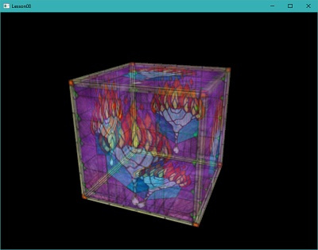

# WebGL for Node.js

This is a part of [Node3D](https://github.com/node-3d) project.

[](https://badge.fury.io/js/webgl-raub)
[](https://www.codefactor.io/repository/github/node-3d/webgl-raub)

```
npm i webgl-raub
```

**Node.js** addon with **WebGL** bindings.

This module **does not provide** a window control system, and it
**can not set up an OpenGL context** on its own. This API simply maps the
native OpenGL function calls to their JS counterpart.

**TL;DR**: see [3d-core-raub](https://github.com/node-3d/3d-core-raub)
for a quick start in a fully sufficient environment.



> Note: this **addon uses N-API**, and therefore is ABI-compatible across different
Node.js versions. Addon binaries are precompiled and **there is no compilation**
step during the `npm i` command.


## Usage

```js
const webgl = require('webgl-raub');
```

Here `webgl` contains all the **WebGL** API, like a `WebGLRenderingContext` instance would.
See
[WebGLRenderingContext docs](https://developer.mozilla.org/en-US/docs/Web/API/WebGLRenderingContext).

To use browser **WebGL** libs, like [three.js](https://threejs.org/),
several additional interfaces must also be provided to mimic the browser.

There is [node-glfw](https://github.com/raub/node-glfw) module, which solves both
window handling and additional browser-like interfaces. It is also bundled into
the [3d-core-raub](https://github.com/node-3d/3d-core-raub) module, for that matter.

```
const webgl = require('webgl-raub');
const { Document } = require('glfw-raub');

Document.setWebgl(webgl); // plug this WebGL impl into the Document

const doc = new Document();
global.document = global.window = doc;

const canvas = document.createElement('canvas'); // === doc
const gl = canvas.getContext('webgl'); // === webgl
```

> OSX Note: some features may depend on OpenGL profile being used. Core profile
is necessary for VAO and other OpenGL 3.2+ features. Depending on your windowing
backend, set the OpenGL profile of your preference.
In case [glfw-raub](https://github.com/raub/node-glfw) is used,
the profile can be set through the `Window`/`Document`
[constructor](https://github.com/node-3d/glfw-raub#class-window) or with
`glfw.windowHint` calls.


---

## Three.js

Being a low level interface, **WebGL** requires a lot of effort to build apps. For
that matter there are numerous frameworks around it. One of them is
[three.js](https://threejs.org/). It is known to work well on **Node.js** with this
implementation of **WebGL**.

You can try to use **three.js** your own way, but there is
a far better option: [node-3d-core](https://github.com/raub/node-3d-core),
which gets you two steps ahead for free.
